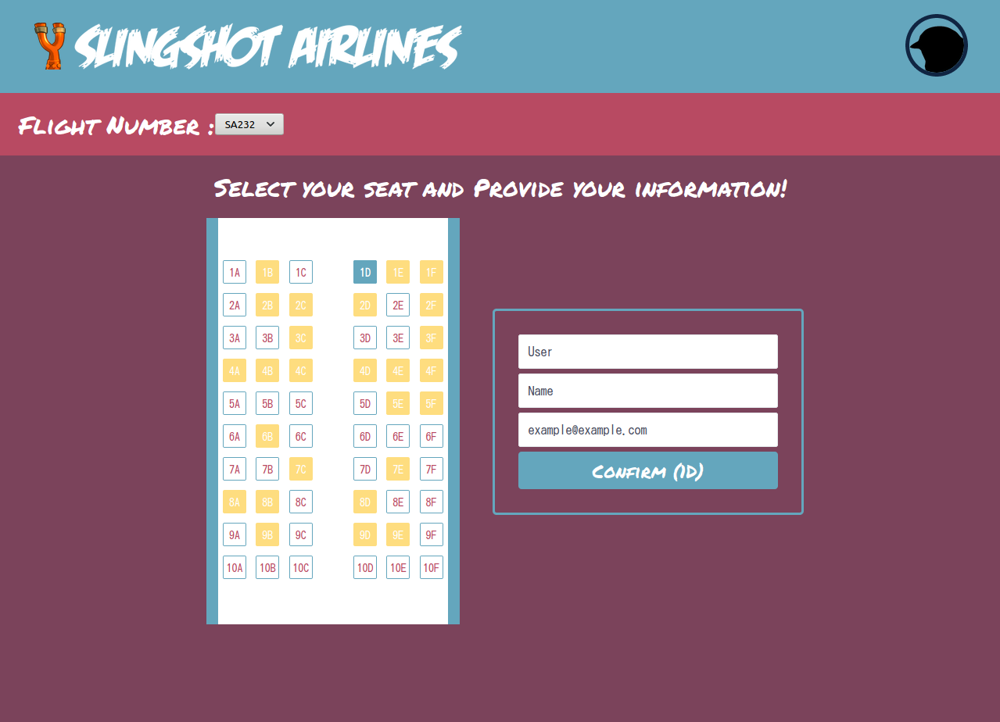
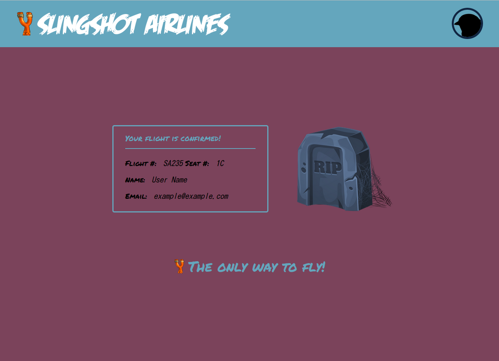

# Slingair NodeJS Project
> Web App used to Book Imaginary Flights with Slingair

The project is live at [flyslingair](https://flyslingair.herokuapp.com/)


## Features

- The app connects with the [Slingair API](https://github.com/andrewbaldwin44/Slingair_API) to provide booking on hundreds of flights, with thousands of users already in the system.
- Data persistence is present, so a user can only register once and a booked seat will no longer be available to anyone for that flight.
- Login to your account to view your booked flight!
- Administrative privilages allow viewing of all flights, all users, and user information on all booked seats.

---

## The App

### Screenshots




### Functionality

- When a user navigates to `/seat-select`, they are presented with an input to enter the flight number.
- With the flight number, make a request to the server for the seating availability on that flight.
- When a response with seating is received, display the seating input as well as the form requesting user's information.
- User selects a seat, enters information and clicks 'Confirm'.
- Contact the server with the data, and wait for a success response to redirect to the `/confirmed.html` page.
- The confirmed page should display a confirmation message to the user with the info that they entered on the previous screen.

## Requirements

- Node.js
- Yarn

## Project Setup

To run the project simply clone the repo and run:

```
yarn install
```

This will start the server and make the pages accessible via their endpoint.

_Note that mutated test data will be preserved as long as your server is running. It stays in memory. The changes will only be reset when the server is restarted._
